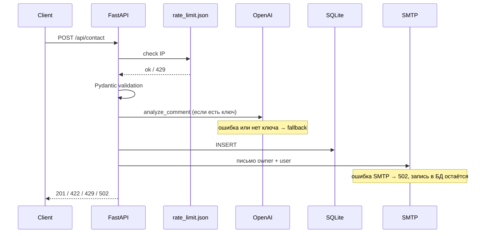

# Dev Landing API

[](CHANGELOG.md)
[](https://www.python.org/)
[](https://fastapi.tiangolo.com/)
[](https://vuejs.org/)
[](LICENSE)

Backend и лендинг для тестового задания: форма обратной связи, OpenAI, письма, rate
limit, метрики. 

Версия **1.0.0** - [CHANGELOG](CHANGELOG.md).

Стек: Python 3.12 · FastAPI · SQLite · Vue 3 · Docker · nginx

```bash
cp .env.example .env
make up      # Docker, всё на :8080
make dev     # backend :8000 + frontend :5173
make test    # pytest + vitest
```

| Адрес | Что там |
|-------|---------|
| http://localhost:8080 | Сайт и API через nginx (`make up`) |
| http://localhost:8080/api/health | Health check |
| http://localhost:8025 | MailHog - смотреть письма |
| http://localhost:8000/docs | Swagger при `make dev` |
| http://localhost:5173 | Vite dev server |

Postman: [postman/dev-landing-api.json](postman/dev-landing-api.json)

---

## Запуск

**Нужно:** Python 3.12 + Poetry, Node 22+, для Docker - Compose.

`make help` - все команды. Основные: `up`, `down`, `dev`, `test`, `lint`, `typecheck`, `pre-commit`.

### Docker

```bash
cp .env.example .env
make up
```

nginx слушает **8080**. Другой порт - `NGINX_PORT` в `.env`.

### Локально

```bash
cp .env.example .env
make dev
```

Поднимает миграции, uvicorn и Vite. Остановка - `Ctrl+C`.

Для фронта при dev: `frontend/.env` с `VITE_API_BASE_URL=http://localhost:8000/api` (есть пример в `frontend/.env.example`).

### Переменные

Полный список в [`.env.example`](.env.example). Главное:

- `OPENAI_API_KEY` - без ключа AI просто не вызывается, форма работает
- `SMTP_HOST` / `SMTP_PORT` - локально `localhost:1025`, в Docker `mailhog:1025`
- `EMAIL_FROM`, `EMAIL_OWNER` - кто шлёт и куда приходит уведомление
- `RATE_LIMIT_REQUESTS`, `RATE_LIMIT_WINDOW_SEC` - лимит с одного IP
- `CORS_ORIGINS` - origins фронтенда

### Проверки перед коммитом

```bash
pip install pre-commit && pre-commit install   # один раз
make lint && make typecheck && make test
```

CI в [`.github/workflows/ci.yml`](.github/workflows/ci.yml): ruff, mypy, pytest, eslint, vitest, build.

---

## Стек

**Backend:** FastAPI, Uvicorn, Pydantic, SQLAlchemy 2 (async), Alembic, aiosmtplib, OpenAI SDK.

**Данные:** SQLite в `data/app.db`, счётчики rate limit в `data/rate_limit.json`.

**Frontend:** Vue 3, Vite, Tailwind 4 - одна страница.

**Инфра:** Docker Compose, nginx, MailHog для SMTP.

**Тесты:** pytest (классы эквивалентности), Vitest. Линтеры: Ruff, mypy, ESLint.

FastAPI взял за async и автодокументацию; 
SQLite хватает для объёма задания; 
Poetry - менеджер зависимостей.

---

## Архитектура

Монолит, три слоя в каждом модуле:

```
router → service → repository
```

| Папка | За что отвечает |
|-------|-----------------|
| `contact/` | Форма, AI, email |
| `metrics/` | Статистика |
| `health/` | `/api/health` |
| `core/` | config, БД, логи, ошибки, rate limit |

Сессия БД - через `ContextVar` и middleware, в репозиториях `get_session()`. 
SMTP и OpenAI вызываются из service.

```
dev-landing-api/
├── backend/app/     contact, metrics, health, core
├── frontend/src/    Vue SPA
├── infra/nginx/
├── postman/
├── data/            gitignore
└── logs/            gitignore
```

### Как проходит заявка



nginx в Docker: `/` → frontend, `/api/` → backend. Письма в dev уходят в MailHog.

---

## API

База: `/api` (через nginx) или `http://localhost:8000/api` при локальном backend.

| Метод | Путь | Ответ |
|-------|------|-------|
| GET | `/health` | статус, версия, ping БД |
| POST | `/contact` | создание заявки |
| GET | `/metrics?days=30` | статистика за период (1–365 дней) |

Документация: `/docs`, `/redoc`.

### POST `/contact`

Тело: `name`, `phone`, `email`, `comment`. Валидация через Pydantic - имя 2–100 символов, телефон 7–20 (цифры, `+`, пробелы, скобки), email, комментарий 10–5000. Пробелы по краям обрезаются.

```bash
curl -X POST http://localhost:8080/api/contact \
  -H "Content-Type: application/json" \
  -d '{
    "name": "Иван Петров",
    "phone": "+79991234567",
    "email": "ivan@example.com",
    "comment": "Интересует сотрудничество на FastAPI."
  }'
```

Успех - `201`, в теле `id`, `message`, `ai_status`, опционально `sentiment` и `request_category`.

Ошибки в едином формате: `{ "error", "message", "details"? }`.

| Код | Когда |
|-----|-------|
| 422 | невалидные поля |
| 429 | rate limit, заголовок `Retry-After` |
| 502 | SMTP упал, заявка уже в базе |
| 500 | необработанное исключение |

Фронт показывает тексты для 422, 429 и 502.

---

## AI

Провайдер - OpenAI (`OPENAI_API_KEY`, `OPENAI_MODEL`, по умолчанию `gpt-4o-mini`).

Функция `analyze_comment()` в `backend/app/contact/ai.py` за один запрос возвращает:

- тональность (`sentiment`)
- тип запроса (`request_category`: collaboration, question, feedback, other)
- черновик ответа (`draft_reply`)

Промпт просит JSON; ответ парсится через Pydantic. Если ключа нет, API вернул ошибку или JSON кривой - пишем в лог, ставим `ai_status: unavailable`, заявку всё равно сохраняем и шлём письма.

---

## Где участвовал AI

| Часть | Кто |
|-------|-----|
| Схема БД, миграции, API, rate limit, AI, тесты backend/frontend | я |
| Вёрстка лендинга, ContactForm, docker/nginx, шаблоны писем, Postman | Cursor, потом правил руками |

---

## Данные и логи

| Файл | Содержимое |
|------|------------|
| `data/app.db` | заявки, поля AI |
| `data/rate_limit.json` | счётчики по IP |
| `logs/requests.log` | каждый HTTP-запрос |
| `logs/app.log` | события приложения |

Метрики (`GET /api/metrics`) считаются из SQLite: total, разбивка по категории и тональности, число `ai_unavailable`.

В Docker `data/` и `logs/` - volumes.

---

## Деплой

Для демо с внешним доступом:

```bash
make up
ngrok http 8080
```

---

## Тесты

```bash
make test
```

Backend - pytest: границы полей, rate limit, fallback AI, 502 при падении почты,
metrics. 
Frontend - Vitest: API-клиент, форма, табы портфолио, переключатель темы.
