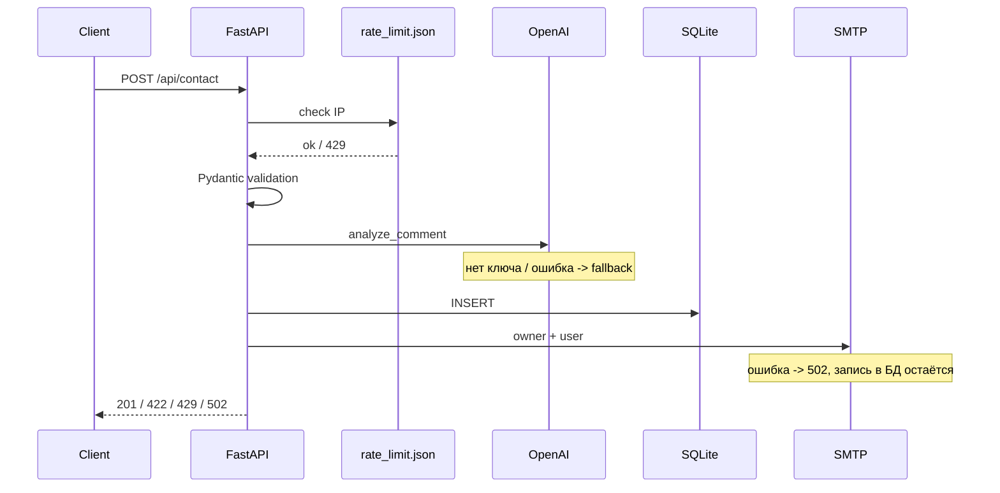

<div align="center">

<br>

# Dev Landing API

<p>
  <strong>FastAPI + Vue 3 landing для разработчика</strong><br>
</p>

<p>
  <a href="CHANGELOG.md"></a>
  <a href="https://www.python.org/"></a>
  <a href="https://fastapi.tiangolo.com/"></a>
  <a href="https://vuejs.org/"></a>
  <a href="LICENSE"></a>
</p>

<p>
  <a href="#быстрый-старт">Быстрый старт</a>
  ·
  <a href="#архитектура">Архитектура</a>
  ·
  <a href="#api">API</a>
  ·
  <a href="CHANGELOG.md">Changelog</a>
  ·
  <a href="postman/dev-landing-api.json">Postman</a>
  ·
  <a href=".github/workflows/ci.yml">CI</a>
</p>

</div>

---

<table>
  <tr>
    <td><strong>Назначение</strong></td>
    <td>Учебный pet-проект с полным циклом: frontend, backend, AI, email, Docker, CI и тесты.</td>
  </tr>
  <tr>
    <td><strong>Демо</strong></td>
    <td><a href="https://kudyasoft-dev-landing-api.hf.space/">
    
  </a></td>
  </tr>
  <tr>
    <td><strong>Формат</strong></td>
    <td>Небольшой слоистый монолит: <code>router -> service -> repository</code>.</td>
  </tr>
  <tr>
    <td><strong>Акцент</strong></td>
    <td>Понятная архитектура, проверяемое поведение, graceful fallback при недоступном AI.</td>
  </tr>
</table>

## Оглавление

<table>
  <tr>
    <td width="33%">
      <strong>Start</strong><br>
      <a href="#быстрый-старт">Быстрый старт</a><br>
      <a href="#запуск">Запуск</a><br>
      <a href="#переменные-окружения">Переменные окружения</a><br>
      <a href="#качество-кода">Качество кода</a>
    </td>
    <td width="33%">
      <strong>System</strong><br>
      <a href="#стек">Стек</a><br>
      <a href="#архитектура">Архитектура</a><br>
      <a href="#api">API</a><br>
      <a href="#ai-интеграция">AI-интеграция</a>
    </td>
    <td width="33%">
      <strong>Ops</strong><br>
      <a href="#данные-и-логи">Данные и логи</a><br>
      <a href="#тесты">Тесты</a><br>
      <a href="#деплой">Деплой</a><br>
      <a href="#разработка-с-ai">Разработка с AI</a>
    </td>
  </tr>
</table>

---

## Быстрый старт

```bash
cp .env.example .env
make up      # Docker: сайт + API на :8080
make dev     # backend :8000 + frontend :5173
make test    # pytest + vitest
```

<table>
  <tr>
    <td><strong>Сайт + API</strong></td>
    <td><a href="http://localhost:8080">http://localhost:8080</a></td>
  </tr>
  <tr>
    <td><strong>Health</strong></td>
    <td><a href="http://localhost:8080/api/health">http://localhost:8080/api/health</a></td>
  </tr>
  <tr>
    <td><strong>Swagger</strong></td>
    <td><a href="http://localhost:8000/docs">http://localhost:8000/docs</a></td>
  </tr>
  <tr>
    <td><strong>MailHog</strong></td>
    <td><a href="http://localhost:8025">http://localhost:8025</a></td>
  </tr>
  <tr>
    <td><strong>Vite</strong></td>
    <td><a href="http://localhost:5173">http://localhost:5173</a></td>
  </tr>
</table>

## Запуск

**Нужно:** Python 3.12 + Poetry, Node 22+, Docker Compose.

`make help` покажет все команды: `up`, `down`, `dev`, `test`, `lint`, `typecheck`, `pre-commit`.

### Docker

```bash
cp .env.example .env
make up
```

nginx слушает порт **8080**. Порт можно поменять через `NGINX_PORT` в `.env`.

### Локально

```bash
cp .env.example .env
make dev
```

Команда запускает миграции, uvicorn и Vite в одном терминале. Остановка — `Ctrl+C`.

Для фронта нужен `frontend/.env`:

```bash
VITE_API_BASE_URL=http://localhost:8000/api
```

### Переменные окружения

Полный список — [`.env.example`](.env.example).

| Переменная                                     | Зачем                                                                       |
| ---------------------------------------------- | --------------------------------------------------------------------------- |
| `OPENAI_API_KEY`                               | AI-анализ. Если ключ пустой, включается fallback, форма продолжает работать |
| `OPENAI_MODEL`                                 | модель OpenAI, по умолчанию `gpt-4o-mini`                                   |
| `SMTP_HOST`, `SMTP_PORT`                       | `localhost:1025` локально или `mailhog:1025` в Docker                       |
| `EMAIL_FROM`, `EMAIL_OWNER`                    | отправитель и получатель email                                              |
| `RATE_LIMIT_REQUESTS`, `RATE_LIMIT_WINDOW_SEC` | лимит заявок с одного IP                                                    |
| `CORS_ORIGINS`                                 | разрешённые origins фронтенда                                               |

### Качество кода

```bash
pip install pre-commit && pre-commit install
make lint && make typecheck && make test
```

CI прогоняет ruff, mypy, pytest, eslint, vitest и production build. Конфиг: [`.github/workflows/ci.yml`](.github/workflows/ci.yml).

---

## Стек

<table>
  <tr>
    <td><strong>Backend</strong></td>
    <td>FastAPI, Uvicorn, Pydantic, SQLAlchemy 2, Alembic</td>
  </tr>
  <tr>
    <td><strong>Frontend</strong></td>
    <td>Vue 3, Vite, Tailwind 4</td>
  </tr>
  <tr>
    <td><strong>AI / Email</strong></td>
    <td>OpenAI SDK, aiosmtplib, Jinja2</td>
  </tr>
  <tr>
    <td><strong>Storage</strong></td>
    <td>SQLite для заявок, JSON-файл для rate limit</td>
  </tr>
  <tr>
    <td><strong>Infra</strong></td>
    <td>Docker Compose, nginx, MailHog, GitHub Actions</td>
  </tr>
  <tr>
    <td><strong>Quality</strong></td>
    <td>pytest, Vitest, Ruff, mypy, ESLint, pre-commit</td>
  </tr>
</table>

<table>
  <tr>
    <td><strong>Почему FastAPI</strong><br>async, OpenAPI, строгие схемы и удобная декомпозиция.</td>
    <td><strong>Почему SQLite</strong><br>достаточно для демо и легко переносится в volume.</td>
    <td><strong>Почему Vue</strong><br>быстрый SPA-лендинг с простыми компонентами и тестами.</td>
  </tr>
</table>

---

## Архитектура

Проект сделан как компактный слоистый монолит:

```text
router -> service -> repository
```

| Модуль     | Назначение                           |
| ---------- | ------------------------------------ |
| `contact/` | форма, AI-анализ, email-уведомления  |
| `metrics/` | статистика по заявкам                |
| `health/`  | health check, версия, ping БД        |
| `core/`    | config, БД, логи, ошибки, rate limit |

Сессия БД хранится через `ContextVar` + middleware; репозитории берут её через `get_session()`. SMTP и OpenAI вынесены из роутеров в service-слой.

```text
dev-landing-api/
├── backend/app/     contact · metrics · health · core
├── frontend/src/    Vue SPA
├── infra/nginx/     reverse proxy
├── postman/         collection
├── data/            runtime data, gitignore
└── logs/            app logs, gitignore
```

### Поток заявки



nginx маршрутизирует `/` во frontend, а `/api/` в backend.

---

## API

База: `/api` через nginx или `http://localhost:8000/api` в dev-режиме.

| Метод  | Путь               | Описание                      |
| ------ | ------------------ | ----------------------------- |
| `GET`  | `/health`          | статус, версия, ping БД       |
| `POST` | `/contact`         | отправка формы обратной связи |
| `GET`  | `/metrics?days=30` | статистика за 1-365 дней      |

Документация: `/docs` и `/redoc`.

### `POST /contact`

| Поле      | Правила                                   |
| --------- | ----------------------------------------- |
| `name`    | 2-100 символов                            |
| `phone`   | 7-20 символов: цифры, `+`, пробелы, `()-` |
| `email`   | валидный email                            |
| `comment` | 10-5000 символов                          |

```bash
curl -X POST http://localhost:8080/api/contact \
  -H "Content-Type: application/json" \
  -d '{
    "name": "Иван Петров",
    "phone": "+79991234567",
    "email": "ivan@example.com",
    "comment": "Интересует сотрудничество на FastAPI."
  }'
```

Успешный ответ `201`: `id`, `message`, `ai_status`, опционально `sentiment`, `request_category`.

| Код   | Ситуация                                |
| ----- | --------------------------------------- |
| `422` | невалидные поля                         |
| `429` | превышен rate limit, есть `Retry-After` |
| `502` | SMTP недоступен, заявка в БД остаётся   |
| `500` | внутренняя ошибка                       |

Формат ошибок: `{ "error", "message", "details"? }`. Фронт отдельно обрабатывает 422, 429 и 502.

---

## AI-интеграция

OpenAI подключается через `OPENAI_API_KEY`; модель задаётся переменной `OPENAI_MODEL`.

`analyze_comment()` в [`backend/app/contact/ai.py`](backend/app/contact/ai.py) возвращает:

| Результат         | Поле               |
| ----------------- | ------------------ |
| тональность       | `sentiment`        |
| категория запроса | `request_category` |
| черновик ответа   | `draft_reply`      |

Если ключ не задан, API OpenAI недоступен или вернулся некорректный JSON, приложение не падает: пишет лог, ставит `ai_status: unavailable`, сохраняет заявку и отправляет письма.

---

## Данные и логи

| Путь                   | Что хранится                  |
| ---------------------- | ----------------------------- |
| `data/app.db`          | заявки и результат AI-анализа |
| `data/rate_limit.json` | счётчики заявок по IP         |
| `logs/requests.log`    | HTTP access log               |
| `logs/app.log`         | события приложения            |

`GET /api/metrics` агрегирует данные из SQLite: `total`, `by_category`, `by_sentiment`, `ai_unavailable_count`.

В Docker `data/` и `logs/` подключаются как volumes.

---

## Тесты

```bash
make test
```

| Слой     | Инструмент | Покрытие                                                      |
| -------- | ---------- | ------------------------------------------------------------- |
| Backend  | pytest     | валидация, rate limit, AI fallback, SMTP 502, metrics, health |
| Frontend | Vitest     | API client, ContactForm, PortfolioSection, ThemeSwitcher      |

Тесты сгруппированы по классам эквивалентности: границы длин, missing fields, limit/limit+1, days 0/1/365/366.

---

## Деплой

```bash
make up
ngrok http 8080
```

Для production: backend на Render/Railway/VPS, frontend как static за nginx, SQLite с volume или PostgreSQL, SMTP и `OPENAI_API_KEY` в secrets.

Текущий публичный демо-стенд: [Hugging Face Spaces](https://kudyasoft-dev-landing-api.hf.space/).

---

## Разработка с AI

| Область                                             | Авторство                    |
| --------------------------------------------------- | ---------------------------- |
| БД, API, AI, rate limit, тесты                      | ручная реализация и проверка |
| Лендинг, ContactForm, Docker/nginx, письма, Postman | Cursor + ручные правки       |

AI использовался как инструмент ускорения разработки, но архитектурные решения, проверка поведения и финальная сборка проекта выполнялись осознанно и вручную.

---

<div align="center">

<sub>dev-landing-api · v1.0.0 · FastAPI · Vue · MIT</sub>

</div>
